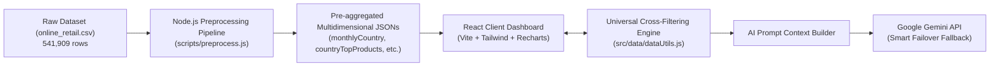

# RetailInsight AI — Retail Sales Intelligence Dashboard & AI Analyst

[](https://reactjs.org/)
[](https://vitejs.dev/)
[](https://tailwindcss.com/)
[](https://recharts.org/)
[](https://ai.google.dev/)

An end-to-end interactive retail intelligence dashboard that empowers decision-makers to analyze multi-million-dollar transaction records from the **Online Retail** dataset through responsive visualizations, universal cross-filtering, and an embedded context-aware AI Analyst powered by **Google Gemini**.

---

## 🌟 Key Features

### 1. Executive KPI Summary Cards
* **Total Revenue**: Metric aggregated across transactions with dynamic currency formatting.
* **Total Orders**: Total unique invoice transactions processed.
* **Units Sold**: Total volume of products sold.
* **Active Customers**: Count of unique registered enterprise and retail clients.

### 2. Universal Multidimensional Cross-Filtering
* **Global Date Range & Country Filters**: Selecting any country or date range instantly recalculates all KPIs, trendlines, top product rankings, customer distributions, and AI context parameters simultaneously with **0ms client-side latency**.
* **Interactive Click-to-Filter**: Clicking on any country bar in the Revenue by Country chart instantly sets the global country filter.

### 3. Revenue by Country & "Exclude UK" Benchmark Toggle
* Solves the extreme home-market skew (~90% of revenue in the UK) by offering a dedicated **[ All ]** vs **[ Excl. UK ]** view toggle, enabling clear visibility and benchmarking of international European markets (Germany, France, EIRE, Netherlands, etc.).

### 4. 8-Tier Customer Spend Segmentation & High-Value Table
* Grouped into 8 realistic business spending brackets (`< £100`, `£100–£250`, `£250–£500`, `£500–£1k`, `£1k–£2.5k`, `£2.5k–£5k`, `£5k–£10k`, `> £10k`).
* Displays customer count and aggregate revenue per tier with progressive visual indicators and a Top 10 High-Value Customers leaderboard.

### 5. Context-Aware AI Analyst (Google Gemini)
* **Live Context Synchronization**: The AI Analyst dynamically ingests the currently active filters and exact computed figures (revenue, top country, top product, customer distribution).
* **Multi-Model Smart Fallback**: Automatically tries models in descending order (`gemini-3.8-flash` → `gemini-3.7-flash` → `gemini-3.6-flash` → `gemini-3.5-flash`) to ensure continuous uptime if a model experiences 503 Overloaded or 429 Rate Limit errors.
* **Strict Guardrails & Token Optimization**: Enforces `temperature: 0.1` and explicit system refusal rules rejecting questions unrelated to the retail dataset in exactly one concise sentence to prevent hallucinations and save API tokens.
* **Quick Insight Chips**: Pre-configured analytical queries for instant one-click analysis.

---

## 🏗️ Architecture & Data Pipeline



---

## 🚀 Getting Started

### Prerequisites
* [Node.js](https://nodejs.org/) (v18 or higher recommended)
* [Google Gemini API Key](https://aistudio.google.com/app/apikey) (Free)

### Installation
1. Clone the repository:
   ```bash
   git clone https://github.com/your-username/retailinsight-ai.git
   cd retailinsight-ai
   ```

2. Install dependencies:
   ```bash
   npm install
   ```

3. Configure Environment Variables:
   Copy `.env.example` to `.env.local` and add your Gemini API key:
   ```bash
   cp .env.example .env.local
   ```
   Edit `.env.local`:
   ```env
   VITE_GEMINI_API_KEY=your_gemini_api_key_here
   VITE_GEMINI_MODEL=gemini-3.8-flash
   ```

4. Run the development server:
   ```bash
   npm run dev
   ```

5. Build for production:
   ```bash
   npm run build
   ```

---

## 📁 Project Structure

```
retailinsight-ai/
├── public/                 # Static assets and icons
├── scripts/
│   └── preprocess.js       # High-performance ETL & multi-dimensional aggregation script
├── src/
│   ├── assets/             # Project brand assets
│   ├── components/         # Modular React UI & Chart components
│   │   ├── AiAnalyst.jsx            # Gemini AI Analyst with multi-model fallback
│   │   ├── CustomerAnalysisChart.jsx # 8-tier customer segmentation & leaderboard
│   │   ├── FilterBar.jsx            # Universal date range & country selector
│   │   ├── KpiCard.jsx              # Executive KPI metric cards
│   │   ├── RevenueByCountryChart.jsx # Country breakdown with Exclude UK toggle
│   │   ├── SalesTrendChart.jsx      # Monthly revenue & order volume trendline
│   │   └── TopProductsChart.jsx     # Best-selling inventory ranking
│   ├── data/               # Aggregated JSON datasets & cross-filtering engine
│   │   └── dataUtils.js             # Real-time multi-dimensional filter calculations
│   ├── App.jsx             # Main dashboard container & state coordinator
│   ├── index.css           # Tailwind CSS directives
│   └── main.jsx            # Application entry point
├── .env.example            # Template for environment configuration
├── package.json            # Project dependencies and build scripts
└── vite.config.js          # Vite build tool configuration
```

---

## 🔮 Future Roadmap (Potensi Pengembangan Lanjutan)

1. **Interactive & Actionable AI Agent**: Integrate tool calling so the AI Analyst can autonomously execute filter selections and zoom into chart anomalies based on voice or chat input.
2. **Predictive Sales Forecasting & Market Basket Analysis**: Implement time-series machine learning models to forecast future inventory demand and identify product association rules for bundle promotions.
3. **Live Streaming Data Pipelines**: Transition from static aggregated JSONs to live streaming database connections (e.g., PostgreSQL / BigQuery) with automated webhook alerts to WhatsApp/Slack.

---

## 📄 License
This project is developed as part of the Capstone Project.
